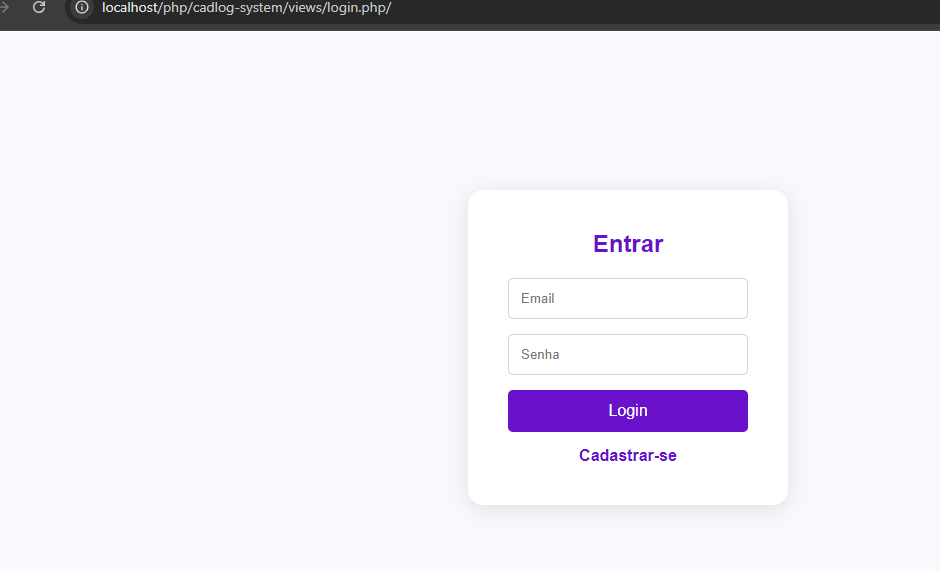
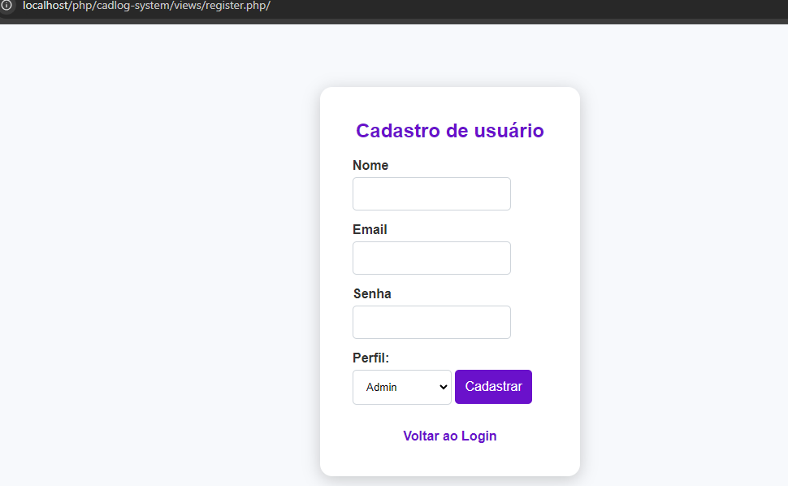

### Descrição do Projeto: Cad-log System !

O Cad-log System é uma aplicação desenvolvida em sala de aula para gerenciar o cadastro de usuários em diferentes perfis: Admin, Gestor e Colaborador. Com foco na segurança e eficiência, a aplicação permite que os usuários façam login, cadastrem novos usuários e gerenciem informações de forma prática e intuitiva.

---

### Funcionalidades ✨

- **Cadastro de Usuários**: Criação de novos usuários com informações como nome, email, senha e perfil. 📝
- **Login de Usuários**: Autenticação segura com validação de credenciais. 🔐
- **Perfis de Usuários**: Três tipos de perfis com diferentes permissões: Admin, Gestor e Colaborador. 👥
- **Interface Intuitiva**: Tela de login e cadastro com design responsivo e acessível. 📱

---

### Estrutura de Arquivos Importantes 📂

#### Descrição dos Arquivos

- **authcontroller.php**: Lógica de autenticação, gerenciando login e logout, validando credenciais e controlando acesso. 🔑
  
- **usercontroller.php**: Gerencia operações relacionadas aos usuários, como criação, atualização e remoção, interagindo com o modelo User. ⚙️
  
- **database.php**: Configura a conexão com o banco de dados, contendo credenciais e configurações para o MySQL. 🗄️
  
- **user.php**: Modelo da entidade User, definindo propriedades e métodos para validação de dados e interações com o banco de dados. 🧑‍💻
  
- **login.php**: Vista que exibe o formulário de login, permitindo a entrada de credenciais. 📄
  
- **register.php**: Vista responsável pelo registro de novos usuários, com formulário de cadastro. ✍️
  
- **index.php**: Ponto de entrada da aplicação, processando requisições e redirecionando usuários. 🚪
  
- **routes.php**: Define rotas da aplicação, mapeando URLs para controladores e funções específicas. 🗺️
  
- **database.sql**: Estrutura do banco de dados e instruções para criação de tabelas necessárias. 📊

---

Esse projeto visa facilitar a gestão de usuários de forma organizada e segura, garantindo uma experiência fluida para todos os perfis. 🌟
 
 ## Imagem :
 
